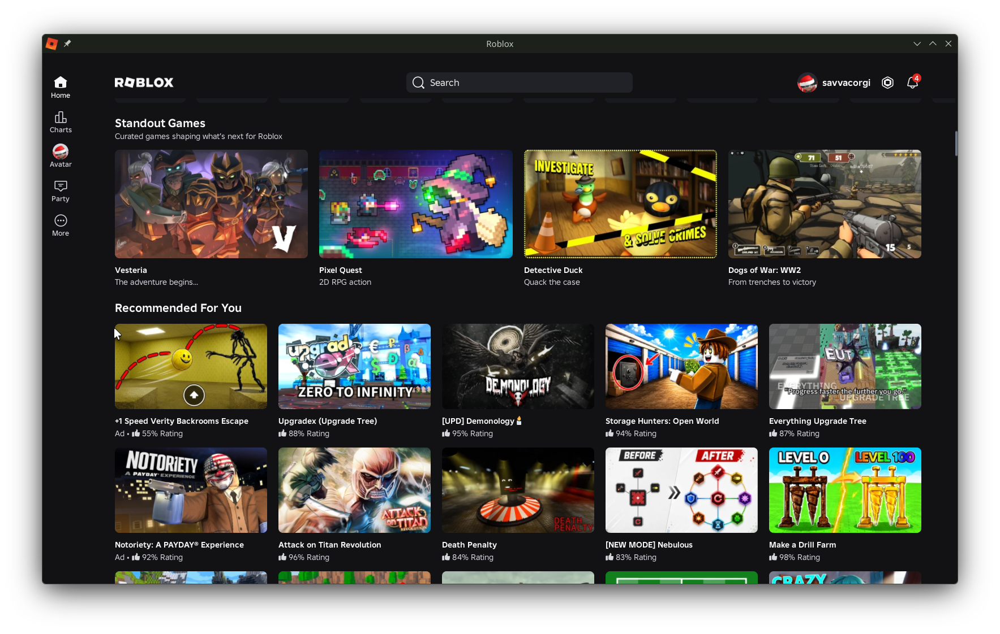
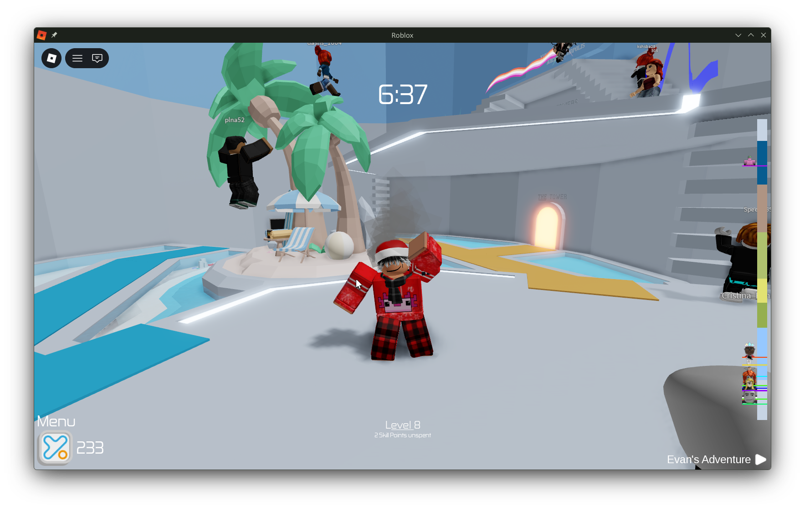
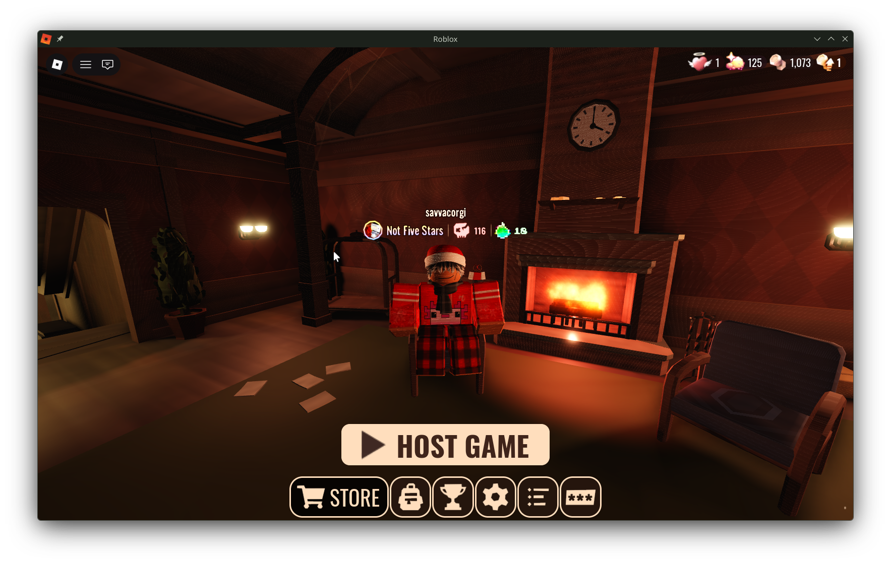

# Mocktail

[](https://github.com/komaruworld/mocktail/actions/workflows/ci.yml)
[](https://github.com/komaruworld/mocktail/stargazers)
[](https://github.com/komaruworld/mocktail/releases/latest)
[](LICENSE)

Mocktail runs the Android `x86_64` Roblox client on Linux. It provides the
Android ABI and JNI pieces the client expects, then uses SDL3 and Vulkan or
OpenGL for the Linux side.

Mocktail is still experimental and may break after a Roblox update. It is not
affiliated with Roblox Corporation or VinegarHQ.

## How it works

```
Roblox APK -> signature and ABI checks -> Bionic + JNI -> SDL3 + Vulkan/OpenGL
```

The APK is checked before any native code is loaded. It is downloaded on first
launch and is not bundled with Mocktail. The last working copy is kept in case
an update fails.

## Install with Flatpak

```bash
flatpak install --user https://mocktail.bigrat.space/mocktail.flatpakref
flatpak run space.bigrat.mocktail
```

## Install from the AUR

Arch Linux users can install either the pinned source release (`mocktail`) or
the current development version (`mocktail-git`) with an AUR helper:

```bash
paru -S mocktail-git
# or
yay -S mocktail-git
```

Use `mocktail` instead of `mocktail-git` to build the pinned release from
source, or install the stable prebuilt package with `paru -S mocktail-bin` or
`yay -S mocktail-bin`.

<details>
<summary>Screenshots</summary>







</details>

## Other Linux packages

The latest AppImage, DEB, RPM, and Arch packages are attached to the
[continuous release](https://github.com/komaruworld/mocktail/releases/tag/continuous).

```bash
# AppImage
chmod +x Mocktail-x86_64.AppImage
./Mocktail-x86_64.AppImage

# Ubuntu/Debian
sudo apt install ./mocktail_*_amd64.deb

# Fedora
sudo dnf install ./mocktail-*.x86_64.rpm

# Arch Linux
sudo pacman -U ./mocktail-*-x86_64.pkg.tar.zst
```

## Building

Only Linux `x86_64` is supported. Building requires CMake 3.20+, Git,
pkg-config, a C++17 compiler, SDL 3.4+, SDL3_ttf, Vulkan, EGL, libplacebo,
fontconfig, libcurl, OpenSSL, libelf, libyaml, minizip, Capstone 5, utf8proc,
nlohmann/json, GTK4, libadwaita 1.6+, and WebKitGTK 6.0.

<details>
<summary>Ubuntu 26.04+</summary>

```bash
sudo apt update
sudo apt install build-essential cmake git ninja-build pkg-config \
  libsdl3-dev libsdl3-ttf-dev libcurl4-openssl-dev libssl-dev \
  nlohmann-json3-dev libyaml-dev libelf-dev libminizip-dev \
  libcapstone-dev libgtk-4-dev libadwaita-1-dev libwebkitgtk-6.0-dev \
  libutf8proc-dev libfontconfig1-dev libegl-dev libvulkan-dev \
  libplacebo-dev zlib1g-dev
```
</details>

<details>
<summary>Arch Linux</summary>

```bash
sudo pacman -S --needed base-devel cmake git ninja pkgconf sdl3 sdl3_ttf \
  curl openssl nlohmann-json libyaml libelf minizip capstone gtk4 \
  libadwaita webkitgtk-6.0 libutf8proc fontconfig libglvnd \
  libplacebo vulkan-headers vulkan-icd-loader zlib
```
</details>

<details>
<summary>Fedora 44+</summary>

```bash
sudo dnf install gcc-c++ cmake git ninja-build pkgconf-pkg-config \
  SDL3-devel SDL3_ttf-devel libcurl-devel openssl-devel \
  nlohmann-json-devel libyaml-devel elfutils-libelf-devel minizip-ng-compat-devel \
  capstone-devel gtk4-devel libadwaita-devel webkitgtk6.0-devel \
  utf8proc-devel fontconfig-devel libglvnd-devel vulkan-headers \
  vulkan-loader-devel libplacebo-devel zlib-ng-compat-devel
```
</details>

```bash
git clone --recurse-submodules https://github.com/komaruworld/mocktail.git
cd mocktail
make build
./build/mocktail
```

## License

[Apache License 2.0](LICENSE). Third-party components keep their own licenses.

## Support

You can support the project by giving it a star or with cryptocurrency:

- USDT (TON): `UQCi6Yzcc9cOctoij6n_r1K90-OdVxAT0D_xo2UzGKkQaJDY`
- USDT (TRC20): `TNPMG9Vig2xiuo2r1QqnXRChPH7Vu28Jmx`
